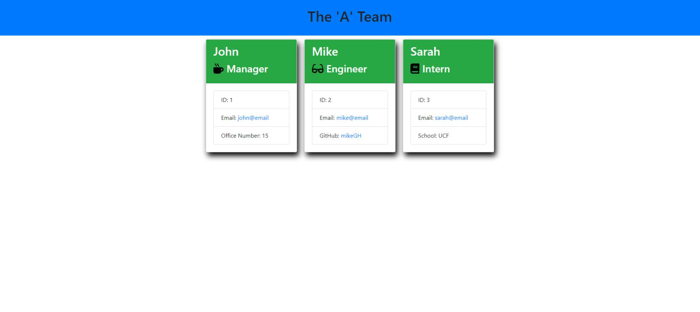

# Team Tagger

## Description

This repo contains an html/css/nodejs application that generates a business team profile based on user input. Commmand line prompts grab user data such as name, id, email, etc and organizes that information in a neat card layout within an html file.

## Table of Contents

* [Installation](#installation)

* [Usage](#usage)

* [Credits](#credits)

* [License](#license)

 

* Prompts the user for information via command line
* Builds out the team members in an array for later use
* Generates a clean markup structure using user information and bootstrap
* Generates the html for convenience

 

This team profile generator is intended to construct an informative summary of one's team efficiently and intuitively.

 

[Team Tagger](https://rickhill543.github.io/team-tagger/)

***

## Installation

To run the team profile generator, copy, clone, or fork this repository and then run the bash command "node index.js" in the root of the application to begin. Application requires the fs and inquirerer dependencies. To install the inquirer package, run the following commands... "npm init" followed by "npm install inquirer". This will setup the necesary packages required by the README application.

***

## Usage

This application is used to help create a quick team profile generator to allow quick access to members email addresses, github accounts, and shcool location. By prompting the users with a set of questions , the file can be generated in just a minute or so in a clean and reapeatable format. Simply answer all the questions and voila! A brand new html file will be generated at the root of the application.

 

Here's a video of the process:
https://drive.google.com/file/d/1h7hjBxN1DqcEbAm-M4B8vmzvc9V27EE8/view

***

## Credits

W3Schools for always being there | 
[W3Schools](https://www.w3schools.com/)

 

***

## License

All Rights Reserved.